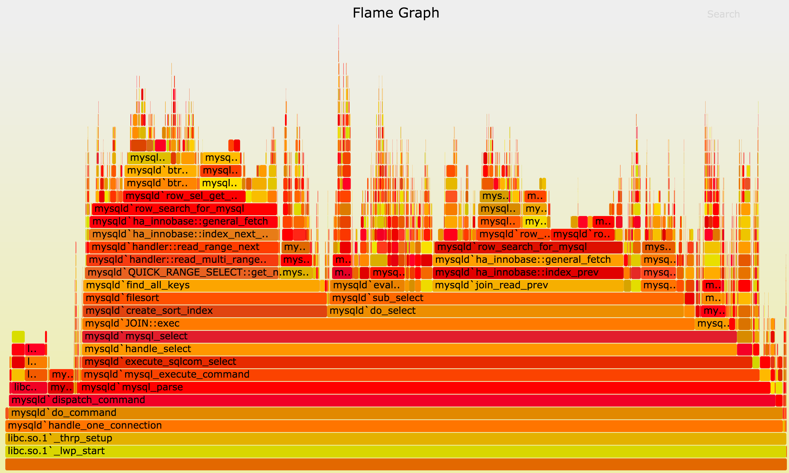

# spark-flamegraph

spark-submit wrapper that generates [Flame Graph](http://www.brendangregg.com/flamegraphs.html).



## Supported Systems

 * Linux
 * macOS (with [Homebrew](https://brew.sh/) installed)

## Prerequisites

The script is adapted for work in [Amazon EMR](https://aws.amazon.com/emr/).
Otherwise the following utilities must present on your system:

 * perl
 * python2.7
 * pip

## Running

```bash
wget -O /usr/local/bin/spark-submit-flamegraph \
  https://raw.githubusercontent.com/spektom/spark-flamegraph/master/spark-submit-flamegraph

chmod +x /usr/local/bin/spark-submit-flamegraph
```

Use `spark-submit-flamegraph` as a replacement for the `spark-submit` command.

To tweak Spark command used for running an application set `SPARK_CMD` environment variable,
for instance to run `spark-shell` use:

```bash
SPARK_CMD=spark-shell /usr/local/bin/spark-submit-flamegraph
```

## Details

The script does the following operations to make profiling Spark applications as easy as possible:

  * Downloads InfluxDB, and starts it on some random port.
  * Starts Spark application using original `spark-submit` command, with the StatsD profiler Jar in its classpath and with the configuration that tells it to report statistics back to the InfluxDB instance.
  * After running Spark application, queries all the reported metrics from the InfluxDB instance.
  * Run a script that generates the .SVG file.
  * Stops the InfluxDB instance.

